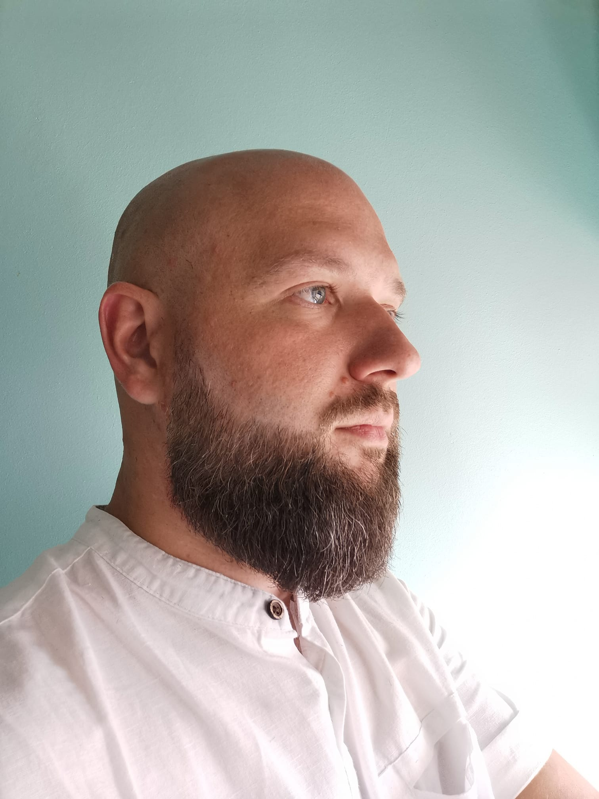

#Paweł Dziembek - moja strona

Demo
https://paweldziembek.github.io/hompage/
Opis
Jestem Paweł Dziembek mam 39 lat mieszkam w Opolu Stolicy Polskiej Piosenki. Przez większą część zawodowego życia zajmowałem się ogólnie pojętą gastronomią. Swoje pierwsze kroki stawiałem jako kelner mając 19 lat, po dwóch latach pracy awansowałem na managera restauracji. To było dla mnie duże wyzwanie, ale również ogromna szansa na rozwój. Restauracja Sphinx w której pracowałem ponad rok decyzją właścicieli została przejęta przez centralę firmy Sphinx i to zmusiło mnie do szukania nowej pracy. 
Kolejne duże wyzwanie rekrutacja w Autogrill Polska Sp. z o.o. włoskiej firmy o międzynarodowym zasięgu, która postanowiła wejść na polski rynek usług gastronomicznych zlokalizowanych przy autostradach, dworcach, lotniskach. Rekrutacja przebiegła pomyślnie i zostałem zatrudniony, ale ze względu na opóźnienia w budowie obiektów rozpoczęcie pracy przesunięto o kilka miesięcy. 
Ten czas spędziłem pracując w Call Center Inter Galactica ucząc się zupełnie nowych rzeczy, sprzedając usługi telekomunikacyjne przez telefon. Zupełnie nowa wiedza i nowe wyzwanie, w tej pracy liczyły się efekty wynikające z zaangażowania oraz umiejętności sprzedaży za pomocą rozmowy sprzedażowej i własnego głosu. Ciekawy etap i dużo cennej wiedzy zdobytej na szkoleniach, warsztatach oraz w praktyce. 
Rozpoczęcie pracy w Autogrill Polska Sp. z o.o. było związane z trzytygodniowym wyjazdem do Włoch na szkolenie do największej restauracji firmy pod Mediolanem żeby poznać działanie firmy od środka. Bardzo intensywny czas w nowym zespole, ucząc się zupełnie innego podejścia do tworzenia restauracji, jedzenia, zarządzania i zadanie przeniesienia tych doświadczeń na tworzone restauracje w  Polsce. Budowanie marki Autogrill Polska od podstaw było bardzo interesującym zadaniem pełnym wyzwań i odkrywaniem gastronomii w innym wydaniu. Po prawie trzech latach pracy zostałem zwolniony i to zmusił mnie do szukania nowej pracy.
Restauracja Kazamaty w Nysie okazała się kolejnym miejscem mojej pracy i możliwość wykorzystania swojej wiedzy w wydaniu lokalnej restauracji i jej właścicieli. To stanowiło dla mnie spore wyzwanie i zderzenie się z zupełnie innymi standardami zarządzania biznesem oraz traktowaniem pracowników. Po półrocznej przepychance podjąłem decyzję o rezygnacji z pracy. 
Centrum Rozrywki Kubatura w Opolu kolejne duże wyzwanie z otwarciem obiektu w tle. Ogromny obiekt obejmujący restaurację, klub muzyczny Sofa, kręgielnię, bilard, pub, salę bankietową. Bardzo intensywny czas z nowymi doświadczeniami i trudna decyzja o zakończeniu współpracy po dwóch miesiącach.
Rozpoczęcie własnej działalności i uruchomienie swojego biznesu po przez budową budynku usługowego, w którym zlokalizowany jest żłobek oraz kuchnia cateringowa. To moje ostatnie pięć lat życia obarczone ciężką pracą i wieloma wyrzeczeniami.
Szukanie nowych możliwości i wykupienie kursu w Youcode na frontend developera z nadzieją na lepszą przyszłość.

